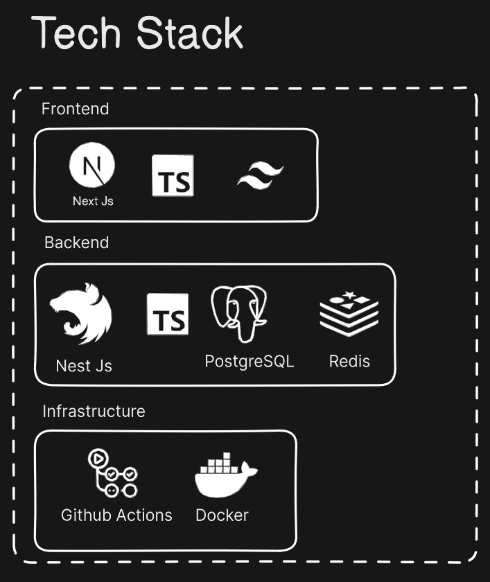
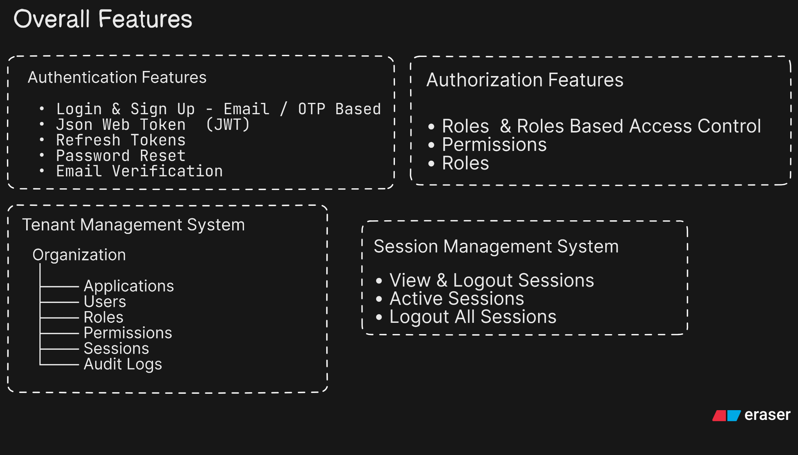
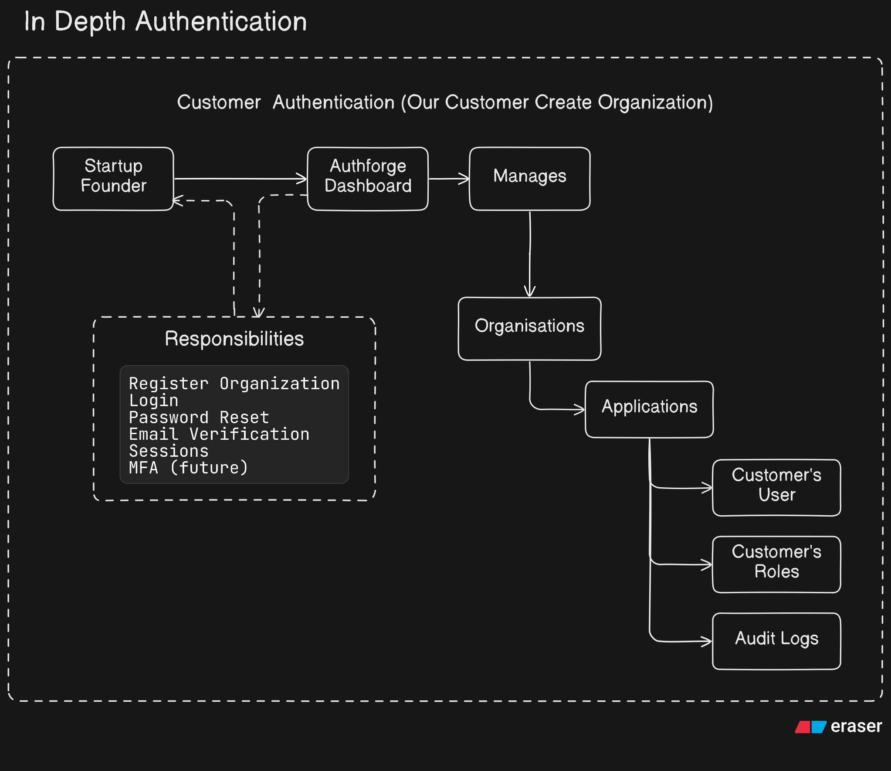
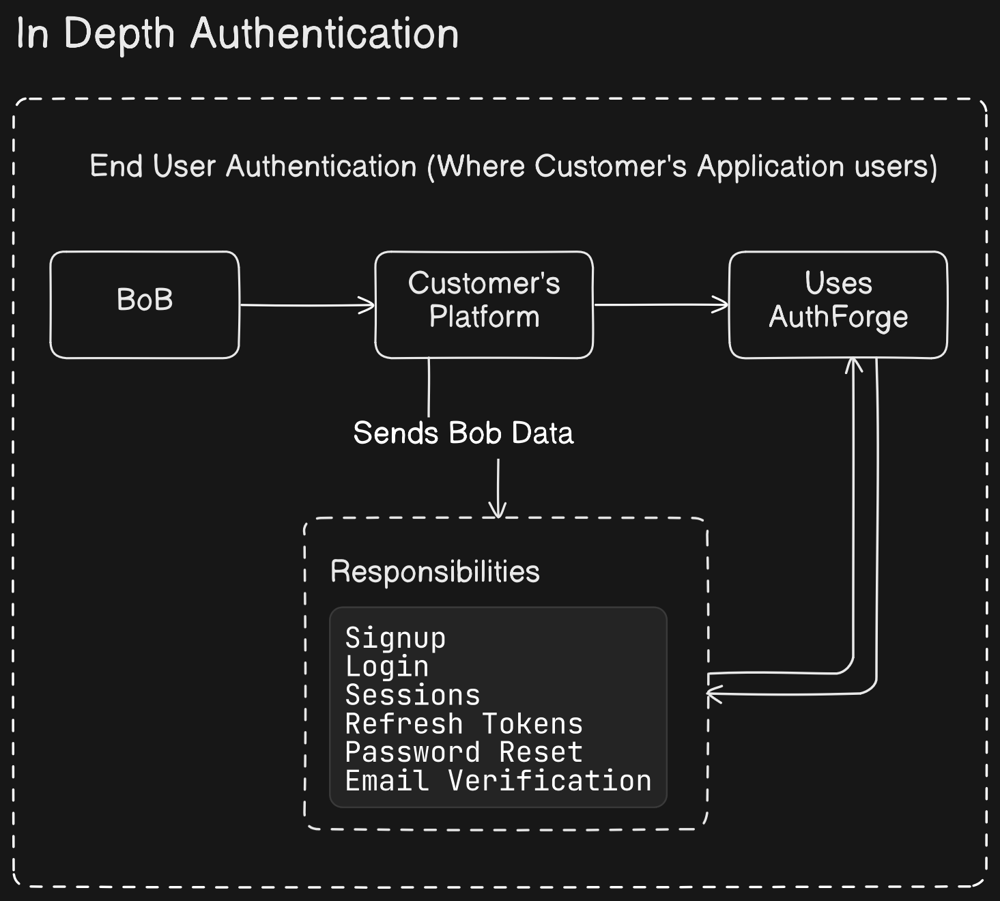

# AuthForge

AuthForge is a high-performance, multi-tenant Identity & Access Management (IAM) platform. It provides enterprise-grade authentication and authorization for organizations and their end-users, built with NestJS, Prisma, PostgreSQL, and Redis.

## 🌟 Core Features

- **Multi-Tenancy**: Native support for Organizations and isolated Applications.
- **Simplified RBAC**: Easy-to-use role system (e.g., "Agent", "Banker") for end-users.
- **Owner-First Security**: Robust `isOwner` flag for guaranteed administrative control.
- **Dual-Key Security**: Separate Publishable (`pk_live_...`) and Secret (`sk_live_...`) keys with bcrypt hashing.
- **Session Management**: Full control over active sessions with instant revocation across devices.
- **Audit Trails**: Immutable logs for all administrative and authentication events.
- **Performance**: Redis-backed session tracking, token blacklisting, and distributed rate limiting.

## 🏗 API Architecture

AuthForge categorizes its APIs into three distinct tiers:

## Architecture & Features









| Tier | Authentication | Use Case |
| :--- | :--- | :--- |
| **Management Dashboard** | `Bearer Member-JWT` | Organization admins managing teams, roles, and apps. |
| **Client-Side Auth** | `x-api-key: pk_live_...` | Frontend applications (Web/Mobile) handling user login. |
| **Server-Side Admin** | `x-api-key: sk_live_...` | Backend SDKs, bulk imports, and server-to-server tasks. |

## 🛠 Environment Configuration

Create a `.env` file in the `backend/` directory (see `backend/.env.example` for reference).

## 🚀 Quick Start

### Local Development
```bash
cd backend
npm install
docker-compose up -d postgres redis
npx prisma migrate dev
npx prisma db seed
npm run start:dev
```

### Production (Docker)
```bash
docker-compose up -d --build
```
The Docker setup automatically handles database migrations and permission seeding.

## 📖 API Documentation

AuthForge ships with a comprehensive Swagger UI available at:
`http://localhost:3000/docs`

### Key Examples

#### 1. Fetch Audit Logs (Dashboard API)
```bash
curl -X GET http://localhost:3000/organizations/:orgId/audit-logs \
  -H "Authorization: Bearer <Member-JWT>"
```

#### 2. Create Application Role (Dashboard API)
```bash
curl -X POST http://localhost:3000/organizations/:orgId/applications/:appId/roles \
  -H "Authorization: Bearer <Member-JWT>" \
  -d '{"name": "Agent", "description": "Support agent role"}'
```

#### 3. End-User Signup (Client API)
```bash
curl -X POST http://localhost:3000/:applicationSlug/auth/signup \
  -H "x-api-key: pk_live_your_key" \
  -d '{"email": "user@example.com", "password": "password123"}'
```

---
*AuthForge is designed for security and scale. For implementation details, refer to `backend/Docs/`.*
